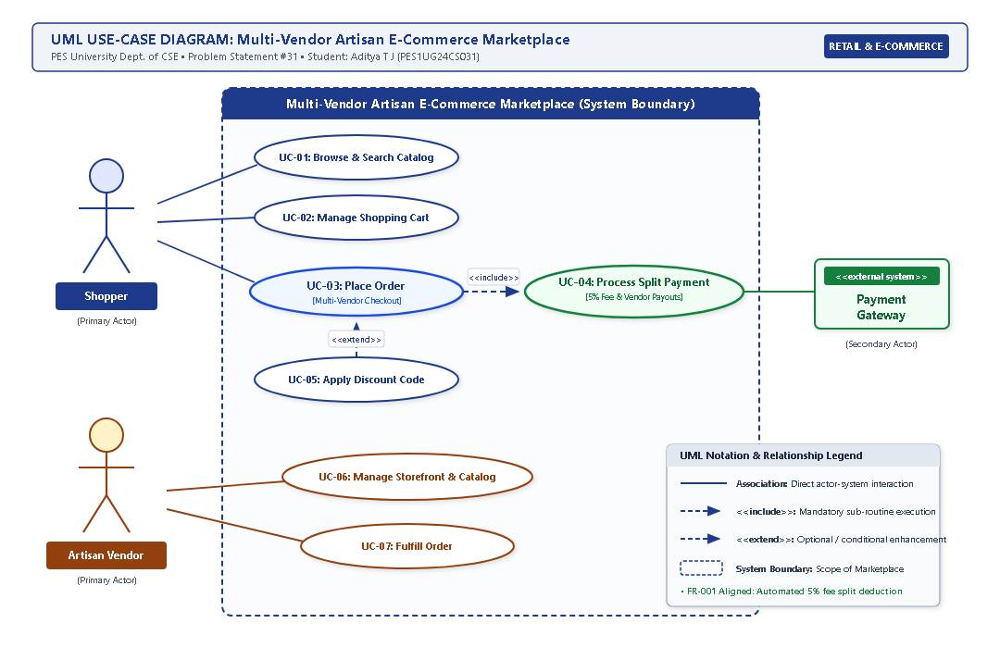

# Lab 1: Requirements Engineering & UML Use-Case Modelling

**Institution:** PES University • Department of Computer Science & Engineering  
**Course:** Software Engineering (UE24CS252)  
**Problem Statement #31:** Multi-Vendor Artisan E-Commerce Marketplace  
**Domain:** Retail, E-Commerce & Finance  
**Student:** Aditya T J (PES1UG24CS031)  

---

## 1. Problem Context & Overview

The **Multi-Vendor Artisan E-Commerce Marketplace** is an online platform that empowers independent craftspeople and artisans to establish digital storefronts, showcase handcrafted product catalogs with rich media, process customer orders, and receive automated split payouts with platform commission deductions.

### Target Stakeholders & Actors
1. **Shopper (Primary Human Actor):** Discovers unique handcrafted items, aggregates goods from multiple distinct artisans in a single unified cart, applies coupons, and executes consolidated checkout orders.
2. **Artisan Vendor (Primary Human Actor):** Manages artisan storefront profile, lists products with craft attributes and stock quantities, monitors incoming sub-orders, and fulfills independent shipments with carrier tracking.
3. **Payment Gateway (Secondary External System Actor):** Securely authorizes multi-party credit card/UPI transactions, validates anti-fraud tokens, and routes settlement disbursement instructions.
4. **Platform Administrator (Secondary Actor):** Supervises platform-wide commission rules (5% deduction), monitors financial audit reconciliations, and handles vendor dispute arbitrations.

---

## 2. Requirements Specification Table

*Complete Requirements Table conforming to the Lab 1 Handout specifications: exactly 5 Functional Requirements (FR-001 to FR-005) and 2 Non-Functional Requirements (NFR-001 & NFR-002).*

| Req ID | Type | Description | Priority | Acceptance Criteria | Rationale | Comments |
| :--- | :--- | :--- | :---: | :--- | :--- | :--- |
| **FR-001** | Functional | The system shall split customer cart payments at checkout, allocating respective item earnings to multiple independent vendor accounts after deducting a 5% platform fee. | **High** | **Pass:** Split payout calculations balance to total cart value.<br>**Fail:** Payout calculation discrepancies. | Ensures accurate, automated financial distribution to independent artisans while securing platform transaction revenue. *(Given in PS #31)* | Core monetization logic; math must strictly balance to 100% of payable order total. |
| **FR-002** | Functional | The system shall allow artisan vendors to set up and manage an independent storefront profile, including artisan bio, shop policies, and linked payout disbursement account details. | **High** | **Pass:** Storefront profile updates and verified payout details are successfully saved and rendered publicly on the artisan's storefront page.<br>**Fail:** Missing mandatory profile fields or unvalidated payout details prevent storefront publishing. | Enables independent craftspeople to establish their distinct brand identity and receive automated financial payouts. | Peer critique: Payout bank credentials must undergo automated format validation prior to store activation. |
| **FR-003** | Functional | The system shall allow artisan vendors to create, update, and manage handcrafted product listings with titles, descriptions, pricing, inventory quantities, and high-resolution product media. | **High** | **Pass:** New or updated product listings appear in the artisan's catalog and marketplace search within 5 seconds with accurate stock counts.<br>**Fail:** Listings with invalid pricing (≤ 0) or missing mandatory attributes fail validation and are rejected. | Empowers artisans to maintain an up-to-date catalog of handcrafted items and prevent overselling through inventory synchronization. | Real-time stock reservation prevents race conditions during concurrent shopper checkouts. |
| **FR-004** | Functional | The system shall allow shoppers to add handcrafted items from multiple independent artisan vendors into a unified cart and execute a single consolidated checkout order. | **High** | **Pass:** Cart aggregates items across distinct vendors, calculates itemized totals, applies applicable coupon discounts, and initiates payment authorization.<br>**Fail:** Cart fails to itemize multi-vendor items or calculation mismatch occurs between item sums and total payable amount. | Provides a seamless purchasing experience for shoppers buying from multiple artisans simultaneously without requiring separate checkout transactions. | Master order automatically decomposes into vendor sub-orders upon successful authorization. |
| **FR-005** | Functional | The system shall notify artisan vendors of confirmed customer orders containing their respective products and allow vendors to update fulfillment status (Processing, Dispatched, Delivered) with carrier tracking details. | **Medium** | **Pass:** Vendor dashboard immediately displays incoming sub-orders upon successful checkout and status transitions trigger automated notifications to the shopper.<br>**Fail:** Order details fail to isolate vendor-specific items or status updates fail to persist. | Enables independent artisans to fulfill customer orders independently while keeping shoppers informed of dispatch status. | Status transitions dispatch transactional email/push notifications containing carrier tracking links. |
| **NFR-001** | Performance & Security | The product catalog must support high-resolution image rendering with CDN caching delivering load times < 500 ms. | **High** | **Pass:** Benchmarking tests confirm target latency (< 500 ms) and security standards under simulated peak load.<br>**Fail:** Catalog page load latency ≥ 500 ms or CDN caching failure under peak load. | Ensures fast page loading for image-heavy handcrafted goods, preserving user engagement and minimizing bounce rates. *(Given in PS #31)* | Optimized WebP/AVIF imagery served via multi-region edge CDN caches; validated via Lighthouse. |
| **NFR-002** | Security & Compliance | The system shall encrypt all sensitive financial transactions and payout account data in transit using TLS 1.3 and at rest using AES-256 encryption, adhering to PCI-DSS Level 1 compliance standards. | **High** | **Pass:** Automated vulnerability scans and penetration audits confirm 100% encryption coverage for payment payloads with zero plain-text storage of payment credentials.<br>**Fail:** Any unencrypted transmission or unmasked storage of sensitive banking/card data detected. | Protects shoppers' financial credentials and vendors' banking payout information against unauthorized access, data breaches, and regulatory non-compliance. | Double-entry append-only transaction ledger ensures 99.999% audit reconciliation accuracy. |

---

## 3. UML Use-Case Diagram




### Actor & Use Case Traceability

| Use Case ID | Use Case Title | Primary Actor / Relationship | Traces to Requirement |
| :--- | :--- | :--- | :--- |
| **UC-01** | Browse & Search Catalog | Shopper | FR-003, NFR-001 |
| **UC-02** | Manage Shopping Cart | Shopper | FR-004 |
| **UC-03** | Place Order [Multi-Vendor Checkout] | Shopper | FR-001, FR-004, NFR-002 |
| **UC-04** | Process Split Payment | Payment Gateway; *`«include»` by UC-03* | FR-001, NFR-002 |
| **UC-05** | Apply Discount Code | Shopper; *`«extend»` to UC-03* | FR-004 |
| **UC-06** | Manage Storefront & Catalog | Artisan Vendor | FR-002, FR-003, NFR-001 |
| **UC-07** | Fulfill Order | Artisan Vendor | FR-005 |

### UML Stereotype Justifications
1. **`«include»` Relationship (UC-03 ➔ UC-04):**  
   * **Source:** `UC-03: Place Order` | **Target:** `UC-04: Process Split Payment`  
   * **Semantics:** Placing an order in a multi-vendor marketplace *unconditionally requires* the split payment mechanism to execute. The system cannot complete checkout without calculating and deducting the 5% platform commission and allocating item revenues to respective vendors. Therefore, `UC-04` is mandatory and included in `UC-03`.
2. **`«extend»` Relationship (UC-05 ➔ UC-03):**  
   * **Source:** `UC-05: Apply Discount Code` | **Target:** `UC-03: Place Order`  
   * **Semantics:** Applying a coupon code is *optional, conditional behavior* that occurs only if the shopper possesses and enters an eligible promotional code. The base checkout workflow operates successfully without a discount; hence, `UC-05` extends `UC-03` at the extension point **"Order Total Calculation"**.

---

## 4. Use-Case Flow Specification

### UC-03: Place Order (Multi-Vendor Checkout with Split Payment)

* **Scope:** Multi-Vendor Artisan E-Commerce Marketplace
* **Primary Actor:** Shopper
* **Secondary Actors:** Payment Gateway (external), Artisan Vendor
* **Trigger:** Shopper selects "Proceed to Checkout" from the active shopping cart view.
* **Traced Requirements:** FR-001, FR-004, NFR-002
* **Relationships:** `«include»` UC-04 Process Split Payment; extended by `«extend»` UC-05 Apply Discount Code

#### Preconditions
1. Shopper is authenticated and has a valid shipping delivery address on file.
2. Shopping cart contains at least one handcrafted item from one or more active artisan storefronts.
3. Item inventory quantities are verified available in the real-time catalog.
4. Each artisan vendor represented in the cart has a verified, active payout account on record.

#### Postconditions
1. A master order record is created and persisted with status `Confirmed`.
2. The master order is decomposed into isolated sub-orders corresponding to each distinct artisan vendor.
3. Full order payment is authorized and captured via the Payment Gateway.
4. The 5% platform fee is deducted and transferred to the marketplace revenue account; net payouts are allocated to vendor escrow ledgers (**FR-001**).
5. Catalog inventory quantities for purchased items are decremented.
6. Order confirmation receipts are dispatched to the shopper and fulfillment alerts sent to artisan vendors.
7. *Failure Guarantee:* In the event of payment or inventory failure, no charges are settled, inventory holds are released, and the cart remains intact.

#### Main Success Scenario
1. Shopper navigates to the checkout view from the multi-vendor shopping cart.
2. System retrieves cart items across all artisan vendors, places a temporary 15-minute hold on inventory counts, and displays an itemized order summary.
3. Shopper selects or confirms the delivery shipping address and contact phone number.
4. System computes shipping costs per artisan vendor, applicable taxes, and presents the grand total payable amount.
5. Shopper selects payment method (Credit/Debit Card, UPI, Net Banking) and enters payment credentials.
6. System invokes **`«include»` UC-04: Process Split Payment**, encrypting transaction payload via TLS 1.3 and dispatching it to the **Payment Gateway**.
7. Payment Gateway authorizes the full consolidated cart amount and returns a success authorization token.
8. System automatically **deducts the 5% platform commission** and allocates remaining item earnings to respective artisan vendor payout accounts (adhering to **FR-001**).
9. System decrements catalog inventory quantities, decomposes master order into isolated vendor sub-orders, and schedules disbursement settlements.
10. System displays an order confirmation screen with unique order IDs and transmits confirmation receipts to the shopper and alert notifications to respective artisan vendors. Use case ends successfully.

#### Alternate Flows
* **6a. Alternate Flow: Payment Authorization Declined (at Step 6 / 7)**
  * **6a1.** Payment Gateway returns an authorization failure code (e.g., insufficient funds, bank timeout, expired card).
  * **6a2.** System logs the transaction attempt, flags order as 'Payment Pending', and presents a clear error message to the shopper without releasing cart items.
  * **6a3.** System prompts the shopper to select an alternate payment method or re-enter valid credentials.
  * **6a4.** If shopper successfully resubmits payment within 3 attempts, flow resumes at **Step 7**.
  * **6a5.** If all payment attempts fail or shopper abandons session, locked inventory is released back to artisan catalogs after 15 minutes and the checkout process terminates.
* **4a. Alternate / Extension Flow: Apply Promotional Discount Code (`«extend»` UC-05, at Step 4)**
  * **4a1.** Shopper enters a promotional coupon code in the checkout discount field and clicks 'Apply'.
  * **4a2.** System validates coupon eligibility against vendor items and cart criteria. If valid, system recalculates the discounted total and updates vendor payout bases; flow resumes at **Step 5**.
  * **4a3.** If coupon is invalid or expired, system displays an inline warning and retains the original cart total without interrupting checkout.

---

## 5. Lab Deliverables Directory

All files have been systematically organized into formal directories:

```
LAB1/
├── README.md                                   # Comprehensive Lab 1 documentation (this document)
├── Requirements_Table.pdf                      # Requirements Table (A4 Landscape PDF)
├── Use_Case_Diagram.pdf                        # UML Use-Case Diagram (A4 Landscape PDF)
├── Use_Case_Flow_Specification.pdf             # Use-Case Flow Specification (Exactly 1-page A4 Portrait PDF)
├── Use_Case_Diagram.svg                        # Standalone vector SVG diagram
├── Use_Case_Diagram.drawio                     # Editable Draw.io diagram source
├── use_case_diagram.png                        # High-resolution PNG preview
│
├── docs/                                       # Formatted submission documents
│   ├── 01_Requirements_Table.pdf              # Publication-grade styled PDF
│   ├── 01_Requirements_Table.docx             # Editable Microsoft Word document
│   ├── 01_Requirements_Table.xlsx             # Formatted Microsoft Excel spreadsheet
│   ├── 02_UseCase_Diagram.pdf                 # Vector PDF diagram
│   ├── 02_UseCase_Diagram.png                 # High-resolution 1080x700 PNG image
│   ├── 03_UseCase_Flow_Specification.pdf      # Exactly 1-page formal flow PDF
│   └── 03_UseCase_Flow_Specification.docx     # Editable Microsoft Word document
│
└── diagram/                                   # Diagram design sources
    ├── artisan_marketplace_usecase.drawio     # Editable XML source for diagrams.net / draw.io
    └── artisan_marketplace_usecase.svg        # Scalable Vector Graphics source
```
